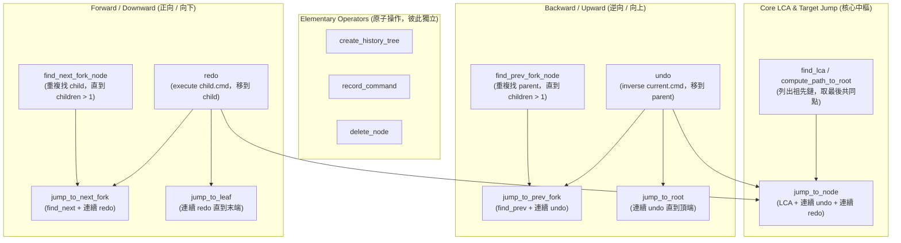

# 0004-2608251715_history-manager-hierarchy-refactor

- **status:** resolved
- **topic:** `history_manager` 操作依賴關係圖與無歧義路徑原則

## 提問與回答

### Q1 · 2026-08-25 17:14（human: wVQ88Soi2Il9）
`src/core/history_manager.ts` 我想進行重構，將所有操作依「調用依賴關係（Call-Dependency DAG）」進行組合與解耦。

### A1 · 2026-08-25 17:15（agent: gemini-3.7-flash）
這個依賴關係圖（Call-Dependency DAG）清晰展現了函式間的組合關係：
1. **箭頭方向代表調用依賴**（由 N 個下層呼叫組成，非資料流向）。
2. **消除重複的 Command 執行邏輯**：
   - 舊實作在 `jump_to_node` 中重複手寫了 while 迴圈反向/正向呼叫 `cmd.inverse(map)` 與 `cmd.execute(map)`。
   - 重構後，所有逆向操作統一依賴 `undo`，所有正向操作統一依賴 `redo`。
3. **對稱性**：補齊 `jump_to_root`，與 `jump_to_leaf` 達成完全鏡像對稱。

### Q2 · 2026-08-25 17:26（human: wVQ88Soi2Il9）
在 fork node（`children.length > 1`）上根本不該能進行向下的盲目操作（無參 redo / find_next）。

### A2 · 2026-08-25 17:26（agent: gemini-3.7-flash）
完全正確。當前節點如果有多個子分支，代表存在路徑歧義，系統嚴格禁止「隨意挑選最後一條分支前進」的隱性假設：
- **`redo(tree, map)`**：只有在 `children.length === 1`（單一確定路徑）時允許單步前進；若 `children.length > 1` 必須明確傳入 `target_child_uid`，否則直接拒絕（回傳 `false`）。
- **`find_next_fork_node`**：若起點或中途遇到 `children.length > 1` 的分岔歧義，立即終止走訪（回傳 `null` 或停在分岔點）。
- 使用者欲在分岔點前進，**必須明確指定目標節點（透過 UI 點選或 `jump_to_node`）**。

### Q3 · 2026-08-25 17:34（human: wVQ88Soi2Il9）
為什麼會需要 find_leaf？不能直接 jump 嗎？

### A3 · 2026-08-25 17:34（agent: gemini-3.7-flash）
完全正確！在無歧義的 Redo 模型下：
- **`jump_to_root(tree, map)`**：`while (undo(tree, map)) { ... }`（一直 undo 直到頂端）。
- **`jump_to_leaf(tree, map)`**：`while (redo(tree, map)) { ... }`（一直 redo 直到單線路徑的最末端或停在分岔點）。
- 兩者完全對稱，徹底消除額外的 `find_leaf_node` 搜尋函式。

---

## 依賴關係圖（Dependency Graph）

---

## 結論

1. `src/core/history_manager.ts` 依照依賴關係圖嚴格實作，徹底移除多餘的 `find_leaf_node`。
2. `jump_to_root`（`while (undo())`）與 `jump_to_leaf`（`while (redo())`）達到極致的鏡像對稱。
3. 確立 Fork 節點無歧義路徑原則。
4. 同步在 `@/core` 與 `@/runtime` 導出 `jump_to_root`。
