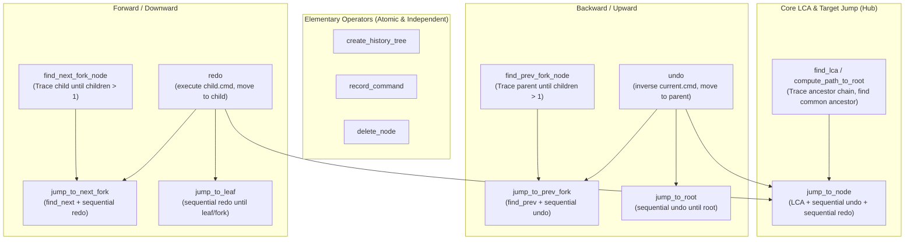

# 2608251715

- **status:** resolved
- **topic:** `history_manager` call-dependency DAG and unambiguous path principle

## Questions and Answers

### Q1 · 2026-08-25 17:14 (human: wVQ88Soi2Il9)
I want to refactor `src/core/history_manager.ts`, composing and decoupling all operations according to a call-dependency DAG.

### A1 · 2026-08-25 17:15 (agent: gemini-3.7-flash)
This Call-Dependency DAG clarifies the composition relationships:
1. **Arrow directions represent call dependencies** (composed of lower-level calls, not data flow).
2. **Eliminating duplicate command execution loops**:
   - The legacy implementation duplicated while-loops manually calling `cmd.inverse(map)` and `cmd.execute(map)` in `jump_to_node`.
   - After refactoring, all backward operations uniformly depend on `undo`, and all forward operations depend on `redo`.
3. **Symmetry**: `jump_to_root` complements `jump_to_leaf`, achieving mirror symmetry.

### Q2 · 2026-08-25 17:26 (human: wVQ88Soi2Il9)
At a fork node (`children.length > 1`), blind downward operations (parameterless `redo` / `find_next`) should not be allowed at all.

### A2 · 2026-08-25 17:26 (agent: gemini-3.7-flash)
Precisely. When the current node has multiple child branches, path ambiguity exists. The system strictly forbids arbitrary assumptions like "pick the last branch":
- **`redo(tree, map)`**: Only permitted to take a single step forward when `children.length === 1` (unambiguous path). If `children.length > 1`, a specific `target_child_uid` must be supplied; otherwise it refuses and returns `false`.
- **`find_next_fork_node`**: If a branch point (`children.length > 1`) is encountered, traversal immediately halts (returns `null` or stops at the fork).
- To advance from a fork node, **the target node must be explicitly specified (via UI click or `jump_to_node`)**.

### Q3 · 2026-08-25 17:34 (human: wVQ88Soi2Il9)
Why do we need `find_leaf`? Can't we just jump directly?

### A3 · 2026-08-25 17:34 (agent: gemini-3.7-flash)
Exactly! Under the unambiguous Redo model:
- **`jump_to_root(tree, map)`**: `while (undo(tree, map)) { ... }` (undo repeatedly until reaching the top).
- **`jump_to_leaf(tree, map)`**: `while (redo(tree, map)) { ... }` (redo repeatedly until reaching the leaf or a fork point).
- Both are completely symmetrical, eliminating the redundant `find_leaf_node` search function.

---

## Dependency Graph

---

## Conclusion

1. `src/core/history_manager.ts` strictly implements this dependency graph, eliminating redundant search functions like `find_leaf_node`.
2. `jump_to_root` (`while (undo())`) and `jump_to_leaf` (`while (redo())`) achieve mirror symmetry.
3. Established the unambiguous path principle at fork nodes.
4. Exported `jump_to_root` in `@/core`.

#core #history #history-manager #history-tree #command #undo #redo #jump #dependency-graph #refactor
