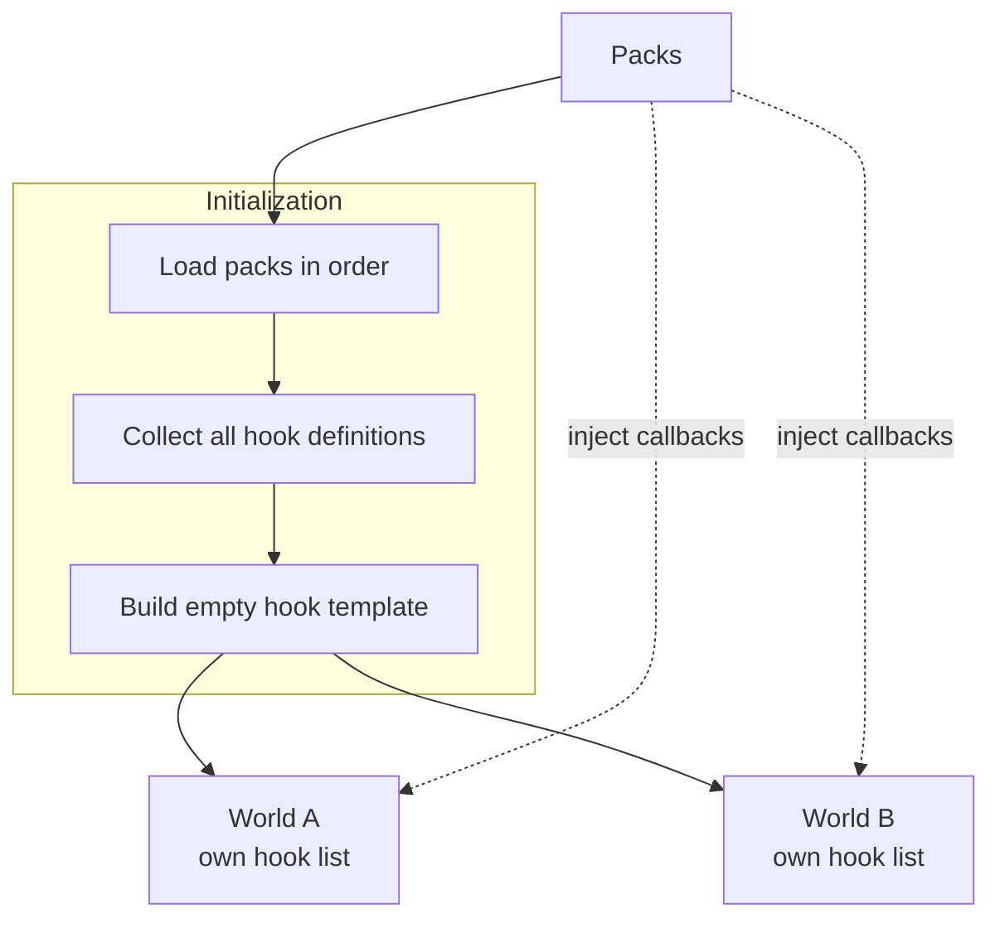
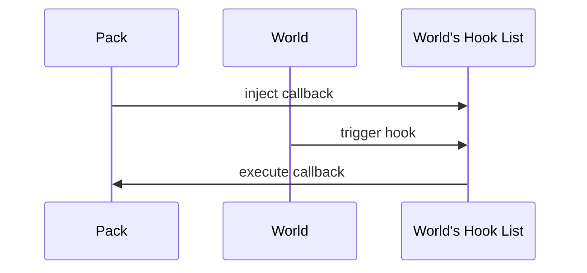

# Runtime Architecture

## Core Idea

Packs define **what the system can do**.  
Worlds hold **what is currently running**.

Therefore, hook **definitions** are discovered once during initialization, but hook **callbacks** belong to each world independently.



## Lifecycle

### 1. Initialize

Load every pack in a deterministic order.

Each pack registers its definitions, including the hooks it may use.

After all packs are loaded, the system knows the complete set of possible hooks and builds an empty hook template.

```text id="alxd7j"
namespace
└── hook
    └── callbacks[]
```

### 2. Create World

A new world receives a fresh hook list from that template.

```text id="fl2y6k"
World A → Hook List A
World B → Hook List B
```

The structure is shared conceptually; the callback lists are not.

### 3. Run World

While a world is running, packs may attach callbacks to that specific world.



This allows the same packs to participate in multiple worlds without sharing runtime state.

## Invariant

> **Hook definitions are global. Hook callbacks are per-world.**

A callback injected into World A must never affect World B.